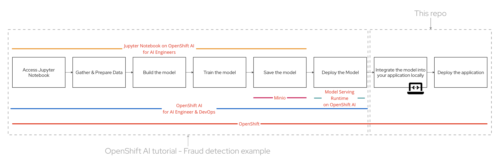
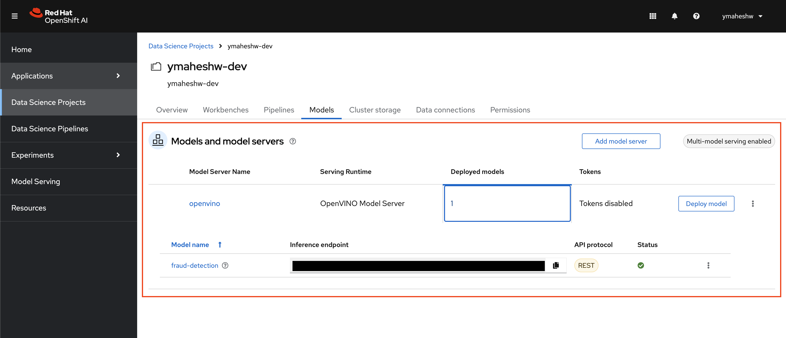
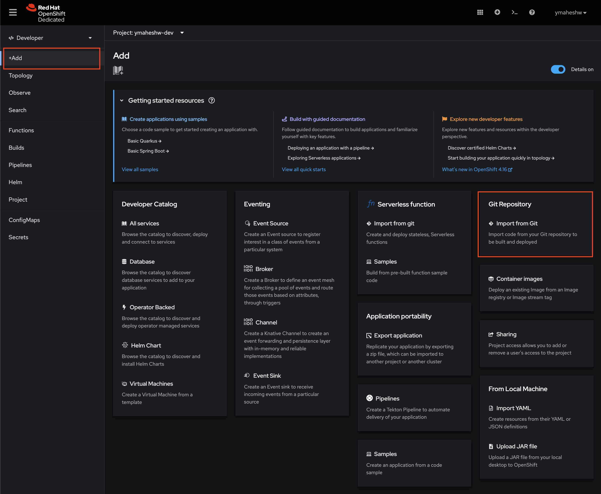
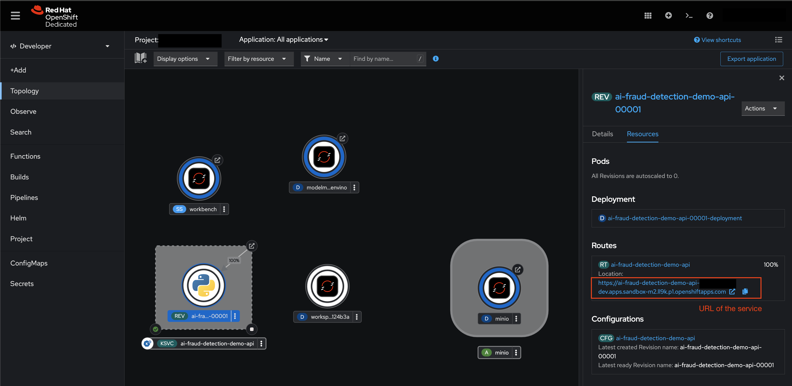

## Creating an AI powered service for detecting fraudulant card transactions
In this demo, we train and deploy a model using OpenShift AI, then integrate it into an application running on OpenShift. This showcases the complete process of how AI engineers develop, train, and deploy models, and how these models are incorporated into applications to deliver AI capabilities to end users.

You will need to finish the steps in [OpenShift AI tutorial - Fraud detection example](https://docs.redhat.com/en/documentation/red_hat_openshift_ai_self-managed/2-latest/html/openshift_ai_tutorial_-_fraud_detection_example/index) before continuing




## About the fraud detection model

The fraud detection model evaluates credit card transactions based on factors like distance from previous transactions, price relative to median spend, and transaction method to determine the likelihood of fraud. 

## Train and Deploy the AI Model using OpenShift AI

Follow [OpenShift AI tutorial - Fraud detection example](https://docs.redhat.com/en/documentation/red_hat_openshift_ai_self-managed/2-latest/html/openshift_ai_tutorial_-_fraud_detection_example/index) to train and deploy the fraud detection model using OpenShift AI Sandbox without any local setup needed. By the end of 4.2 you will have the applicaiton up and running on OpenShift AI




## Integrate the AI Model into your application
Integrate the fraud detection AI Model into your API that tells if a transaction is fraud or not. See [app.py](https://github.com/yashwanthm/ai-fraud-detection-demo-api/blob/main/app.py) for details

### About this service

This is an internal platform service that helps other applications interface with the AI Model where, the service accepts an array as follows:

    [distance, ratio_to_median, pin, chip, online]

And responds back with a message

    {
	    message: "fraud/not fraud"
    }

Let's understand this by using some example scenarios for the transaction
-   **distance** - same location as the last transaction (distance=0)
-   **ration_to_median** - same median price as the last transaction (ratio_to_median=1)
-   **pin** - using a pin number (pin=1)
-   **chip** - using the credit card chip (chip=1)
-   **online** - not an online transaction (online=0)

## Deploying this service

- Copy the URL of this repo
- Login into your [OpenShift Developer Sandbox](https://console.redhat.com/openshift/sandbox)
- Get into the Developer view 
- Click "+Add"
- Select "Import from Git"

- Paste the URL of the repo
- Enter the port as 5000
- Click on Create 

- Wait for the build to progress, once it's complete, your should see something like this on the topology view

- Try a POST request on your terminal
    ```
    curl -X POST http://<ENTER YOUR ENDPOINT> -H "Content-Type: application/json" -d '{"data": [100, 1.2, 0.0, 0.0, 1.0]}' 
    ```

### Case 1: Not a fradulent transaction
In this example, the user is buying a coffee. The parameters given to the model are:
-   same location as the last transaction (distance=0)
-   same median price as the last transaction (ratio_to_median=1)
-   using a pin number (pin=1)
-   using the credit card chip (chip=1)
-   not an online transaction (online=0)

`[0.0, 1.0, 1.0, 1.0, 0.0]`

```
curl -X POST http://<ENTER YOUR ENDPOINT> -H "Content-Type: application/json" -d '{"data": [0.0, 1.0, 1.0, 1.0, 0.0]}'
```

### Case 2: fraudulent transaction
In this example, someone stole the user's credit card and is buying something online. The parameters given to the model are:

-   very far away from the last transaction (distance=100)
-   median price similar to the last transaction (ratio_to_median=1.2)
-   not using a pin number (pin=0)
-   not using the credit card chip (chip=0)
-   is an online transaction (online=1)

`[100, 1.2, 0.0, 0.0, 1.0]`
```
curl -X POST http://<ENTER YOUR ENDPOINT> -H "Content-Type: application/json" -d '{"data": [100, 1.2, 0.0, 0.0, 1.0]}'
```

Try your own requests and have some fun :)

### For running locally: 
```export FLASK_ENV=development```