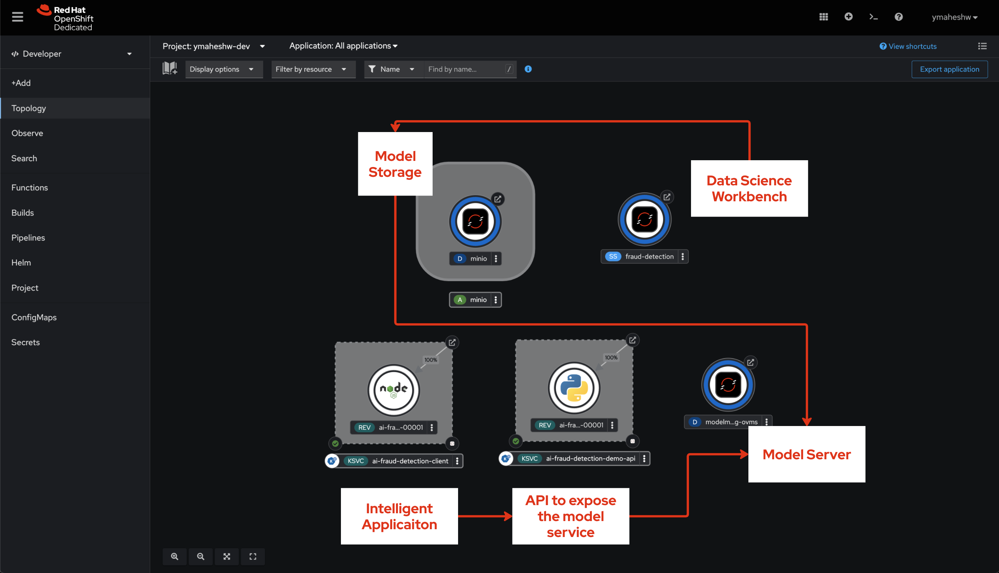
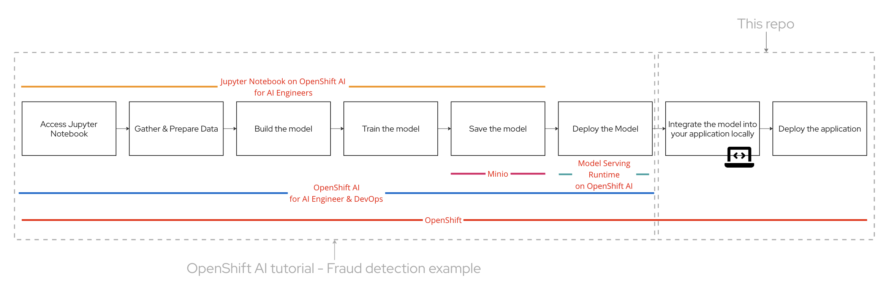
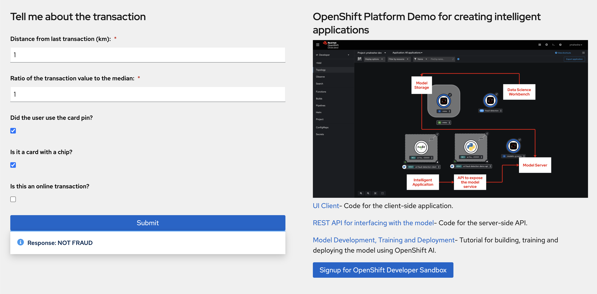

## Red Hat OpenShift Demo - Platform for Intelligent Applicaiton 
The demo showcases how OpenShift serves as a unified platform for
- **Data Science/AI Engineers** to build, train, test deploy a model using OpenShift AI, 
- **Application Developers** to integrate the model into applications and deploy them to  OpenShift to deliver AI Inferencing capabilities to end users

## Overview
Using OpenShift for building intelligent applications is showcased using the 3 deployments:
- **[AI Model](https://github.com/rh-aiservices-bu/fraud-detection/blob/main/1_experiment_train.ipynb)** - onnx model deployed to OpenVINO Model Server on OpenShift AI as an internal service to the cluster
- **[REST API](https://github.com/yashwanthm/ai-platform-demo/blob/main/app.py)** - A Python based API that mediates between the AI Model and the end user UI
- **[UI](https://github.com/yashwanthm/ai-fraud-detection-client/blob/main/src/app.js)** - A React based UI that accepts inputs from the user and delivers AI Inferencing capabilities by integrating with the Python based REST API that inturn talks to the AI Model instance

Here's how it all comes together:


1. **Data Science Workbench** - A cloud-based, managed environment for data scientists and developers to run Jupyter Notebooks. We use this to build, train, test and store the model to model storage
2. **Model Storage** - We use Minio as an static file storage to store the model and make it available for the model server. [setup-s3.yaml](setup-s3.yaml) is used to 

    1. **ServiceAccount Creation** - Create a `demo-setup` Service Account to provide access control for subsequent components.

    2. **RoleBinding** - Create a `demo-setup-edit` RoleBinding that assigns the `edit` ClusterRole to the `demo-setup` Service Account, providing it with the necessary permissions to manage resources within the namespace.

    3. **MinIO Service** - Create a `minio` Service that exposes MinIO's API on port `9000` and its console on port `9090` within the cluster.

    4. **PersistentVolumeClaim** - Create a `minio` PersistentVolumeClaim that requests `200Gi` of storage to provide persistent storage for MinIO data.

    5. **MinIO Deployment** - Deploy a `minio` instance with 1 replica using the latest MinIO image from Quay.io. The deployment requests `200m` of CPU and `1Gi` of memory, with limits set to `2 CPUs` and `2Gi` of memory. The `/data` directory in the container is mounted to the persistent volume.

    6. **Create DS Connections Job** - Create a `create-ds-connections` Job that waits for the MinIO service and root user secret to be ready, then creates two Kubernetes secrets (`aws-connection-my-storage` and `aws-connection-pipeline-artifacts`) to store MinIO access credentials for the data science platform.

    7. **Create MinIO Buckets Job** - Create a `create-minio-buckets` Job that creates the `pipeline-artifacts` and `my-storage` S3 buckets in MinIO if they do not already exist.

    8. **Create MinIO Root User Job** - Create a `create-minio-root-user` Job that generates and stores MinIO's root user credentials in a Kubernetes secret named `minio-root-user`, if the secret doesn’t already exist.

    9. **MinIO Routes** - Create two routes, `minio-console` and `minio-s3`, to expose MinIO's console and API externally via HTTPS with edge TLS termination.

3. **Model Server** - On this demo use a OpenVINO Multi Model Serving Runtime and deploy our model. The deployed model is available on a route that's internal to the cluster
4. **API** - A simple Python based REST API that acts as a gateway between the end user application and the Model Server
5. **UI Client** - An application to be used by the end users, talks to the API gateway that inturn talks to the model server and delivers the AI Inferencing capability to the end user


## About the fraud detection model

The fraud detection model is a fully connected feedforward deep neural network designed to evaluate credit card transactions. It considers factors such as the distance from previous transactions, price relative to median spend, and transaction method. The model includes an input layer for transaction features, three hidden dense layers with ReLU activation, batch normalization, and dropout for regularization. The output layer, with a single neuron using a sigmoid activation function, classifies transactions as fraudulent if the output exceeds a 0.95 threshold.

## Train and Deploy the AI Model using OpenShift AI

To train and deploy the fraud detection model using OpenShift AI Sandbox without any local setup needed, follow the steps in the [OpenShift AI tutorial - Fraud detection example](https://docs.redhat.com/en/documentation/red_hat_openshift_ai_self-managed/2-latest/html/openshift_ai_tutorial_-_fraud_detection_example/index). By the end of section 4.2, you will have the application up and running on OpenShift AI.


Once you have finished the steps, you should see this


## Integrate the AI Model into your application
Integrate the fraud detection AI Model into your API that tells if a transaction is fraud or not. See [app.py](https://github.com/yashwanthm/ai-fraud-detection-demo-api/blob/main/app.py) for details


### API service

This is an internal platform service that helps other applications interface with the AI Model where, the service accepts an array as follows:

    [distance, ratio_to_median, pin, chip, online]

And responds back with a message

    {
	    message: "fraud/not fraud"
    }

Let's understand this by using some example scenarios for the transaction
-   **distance** - same location as the last transaction (distance=0)
-   **ration_to_median** - same median price as the last transaction (ratio_to_median=1)
-   **pin** - using a pin number (pin=1)
-   **chip** - using the credit card chip (chip=1)
-   **online** - not an online transaction (online=0)

#### Deploying the API Service

- Copy the URL of this repo
- Login into your [OpenShift Developer Sandbox](https://console.redhat.com/openshift/sandbox)
- Get into the Developer view 
- Click "+Add"
- Select "Import from Git"

- Paste the URL of the repo, you will notice that OpenShift automatically detects Python as the base image
- Enter the port as 5000
- Click on Create 

- Wait for the build to progress, once it's complete, your should see something like this on the topology view

- Try a POST request on your terminal
    ```
    curl -X POST http://<ENTER YOUR ENDPOINT> -H "Content-Type: application/json" -d '{"data": [100, 1.2, 0.0, 0.0, 1.0]}' 
    ```

### About the end user application
This is a simple React based application that renders a form and is integrated with the API service which inturn talks to the model server

#### Deploying the end user application
This is very similar to the previous step
- Copy the URL of [ai-fraud-detection-client](https://github.com/yashwanthm/ai-fraud-detection-client) repo
- Login into your [OpenShift Developer Sandbox](https://console.redhat.com/openshift/sandbox)
- Get into the Developer view 
- Click "+Add"
- Select "Import from Git"
- Paste the URL of the repo, you will notice that OpenShift automatically detects Node.js as the base image
- Click on Create 
- Wait for the build to progress, once it's complete, your should see something like this on the topology view

## Testing the End-To-End Flow - AI Inferencing on end user applciations


#### Case 1: Not a fradulent transaction
In this example, the user is buying a coffee. The parameters given to the model are:
-   same location as the last transaction (distance=0)
-   same median price as the last transaction (ratio_to_median=1)
-   using a pin number (pin=1)
-   using the credit card chip (chip=1)
-   not an online transaction (online=0)

The app would create this as the payload - `[0.0, 1.0, 1.0, 1.0, 0.0]`

```
curl -X POST http://<ENTER YOUR ENDPOINT> -H "Content-Type: application/json" -d '{"data": [0.0, 1.0, 1.0, 1.0, 0.0]}'
```

#### Case 2: fraudulent transaction
In this example, someone stole the user's credit card and is buying something online. The parameters given to the model are:

-   very far away from the last transaction (distance=100)
-   median price similar to the last transaction (ratio_to_median=1.2)
-   not using a pin number (pin=0)
-   not using the credit card chip (chip=0)
-   is an online transaction (online=1)

The app would create this as payload - `[100, 1.2, 0.0, 0.0, 1.0]`


Try your own form inputs and have some fun :)

